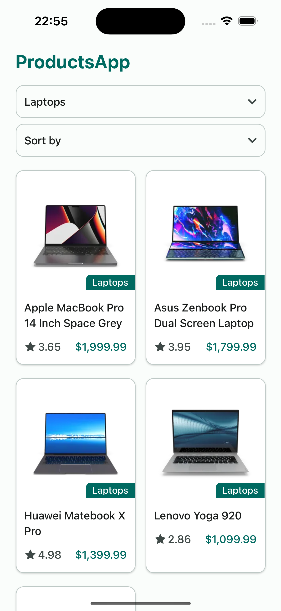
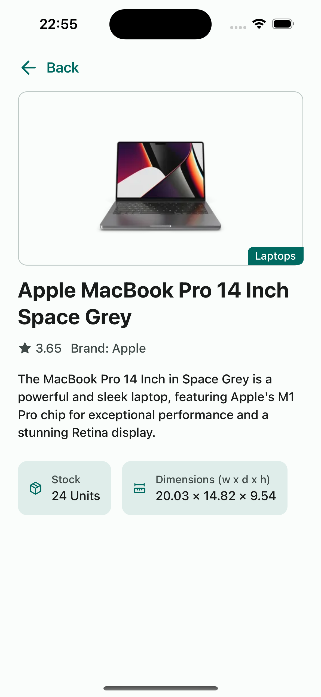
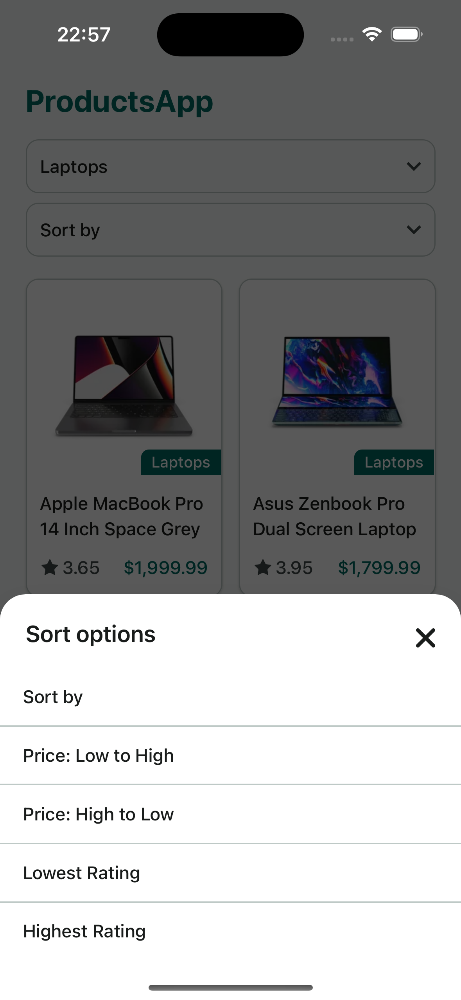
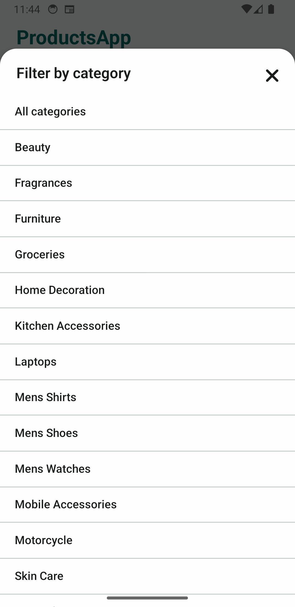

# Products App

Challenge for Mobile Engineer role at Modak

---

## 📋 Table of Contents

- 📱 Screens
- 🛠 Technologies
- 🚀 Getting Started
  - 🔧 Prerequisites
  - 📦 Running the App

---

## 🎨 Screens

<p>




</p>

---

## 🛠 Technologies

- 📱 React Native — Mobile app framework
- 📡 Fetch API + React Query — For HTTP requests
- 🪙 Yarn — Dependency management
- 🛳️ React Navigation — Navigation
- 📝 Zod — Schema validation
- 🖼️ React Obsidian — Dependency injection

---

## 🚀 Getting Started

### 🔧 Prerequisites

This project uses ASDF to manage versions of Node.js, Ruby, and Java.  
If you don’t have ASDF installed, follow their guide: https://asdf-vm.com/guide/getting-started.html

Add the necessary plugins:

```bash
asdf plugin add nodejs
asdf plugin add ruby
asdf plugin add java
```

Install the required versions:

```bash
asdf install
```

---

### 📦 Running the App

1. Install Ruby dependencies:

```bash
bundle install
```

2. Install iOS dependencies (only for iOS):

```bash
cd ios && bundle exec pod install && cd ..
```

3. Start the Metro bundler:

```bash
yarn start
```

4. Run the app:

- For Android:

  ```bash
  yarn android
  ```

- For iOS:
  ```bash
  yarn ios
  ```

---
